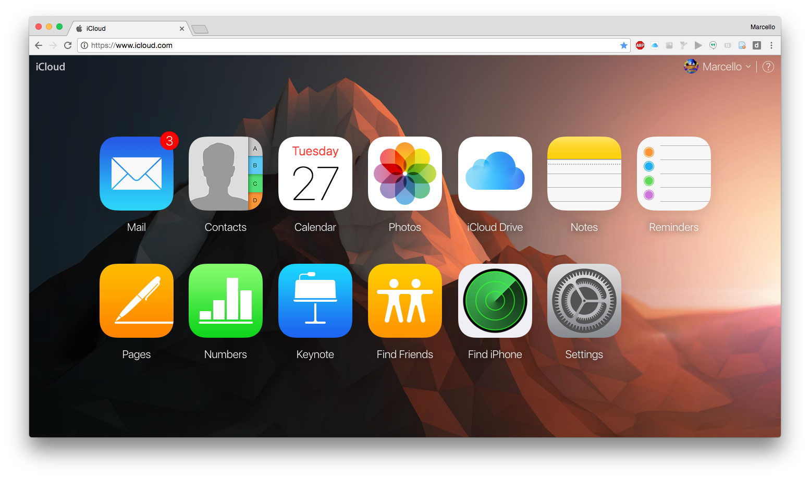

# daylight
A Chrome extension to customise the Apple iCloud web interface

### Notes
- Images will need to be the same size otherwise the ease-in-out property looks stretchy (try it, that's the best i can explain)

### Installation
- To test the extension yourself, download and extract daylight*.zip and then follow these instructions: https://developer.chrome.com/extensions/getstarted#unpacked

### Credits
- flutberf - http://imgur.com/gallery/hvLyp
